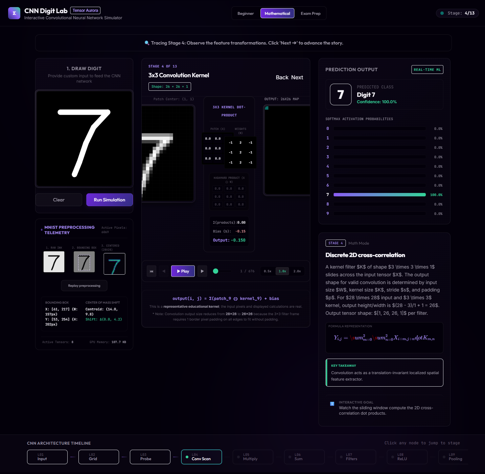
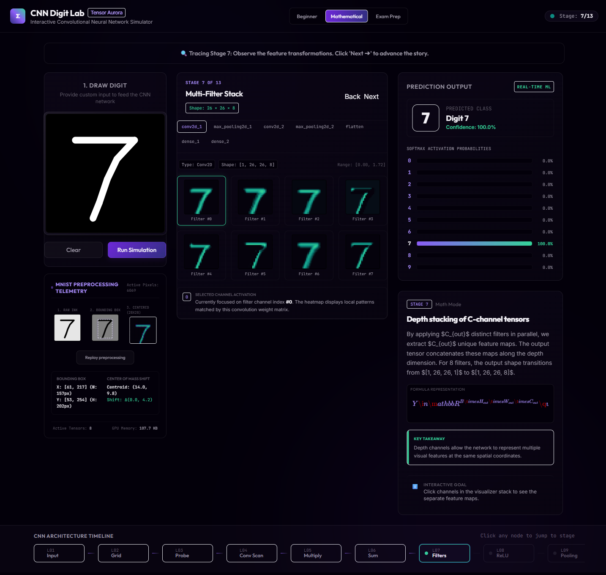
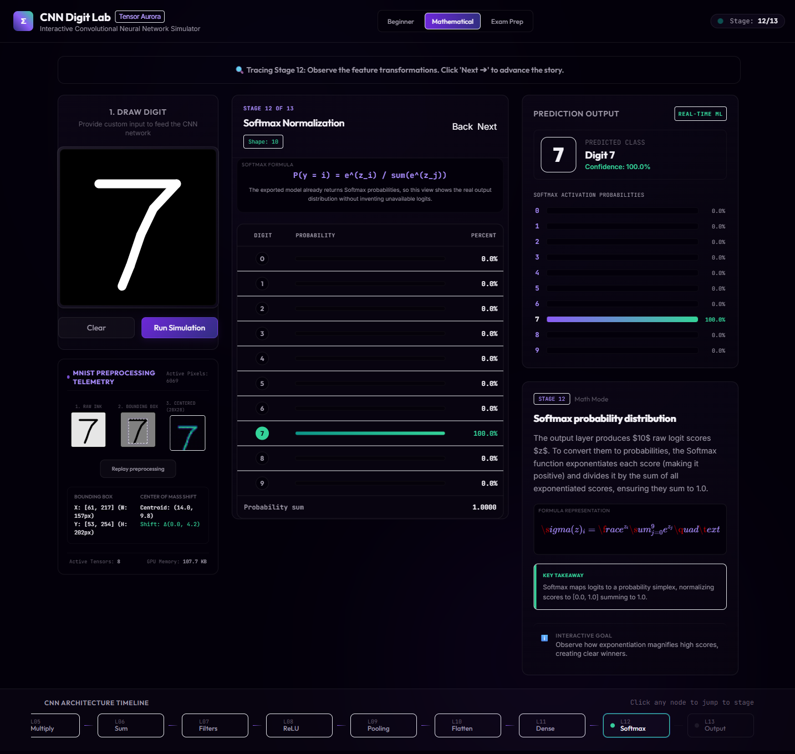

# CNN Digit Lab — Tensor Aurora

[](LICENSE)
[](https://github.com/osamaPY/cnn_simulation/actions/workflows/deploy-pages.yml)

**Draw a digit, run a real CNN in your browser, and inspect how every major
transformation changes the data.**

CNN Digit Lab is a free interactive lesson combining real TensorFlow.js
inference, intermediate activation maps, step-driven explanations, and three
teaching modes inside a responsive Tensor Aurora interface.

> **Live demo:** Coming soon. The repository includes the exported TensorFlow.js model and is ready for deployment.
>
> **Demo GIF:** Pending final deployment capture. The screenshots below show the current application.

## Preview

| Convolution stage | Real feature maps | Softmax and prediction |
| --- | --- | --- |
|  |  |  |

## Why This Project Exists

CNNs are often taught as a stack of formulas or a single architecture diagram.
This project lets learners draw an input, inspect real intermediate values, and
connect each mathematical operation to a visible transformation.

## For Students

Use the timeline and Beginner, Mathematical, and Exam Prep modes to understand
tensors, kernels, feature maps, ReLU, pooling, flattening, dense layers, and
Softmax probabilities.

## Features

- Mouse and touch drawing canvas with MNIST-style preprocessing
- Bounding-box crop, resize, center-of-mass alignment, and normalization
- In-browser TensorFlow.js inference and intermediate activation extraction
- Included compact CNN model with 98.43% MNIST test accuracy
- Thirteen navigable CNN learning stages
- Canvas-rendered tensor grids and feature-map heatmaps
- Step-driven convolution, pooling, flatten, dense, and softmax explanations
- Beginner, Mathematical, and Exam Prep teaching modes
- Tensor Aurora design tokens and reduced-motion support
- Responsive desktop, tablet, and phone layouts
- Focused Vitest coverage for math and preprocessing contracts

## What Is Real And What Is Simplified

**Real:** drawing preprocessing, model prediction, Softmax probabilities,
intermediate activation arrays, feature maps, and displayed tensor shapes.

**Educational simplified views:** the convolution lesson may show a labeled
representative kernel, and dense-layer wiring shows a labeled sampled subset.
The app never invents predictions or activations when model data is missing.

## Tech Stack

- React 19 + TypeScript + Vite
- TensorFlow.js
- Framer Motion
- Zustand
- Canvas 2D + SVG
- Tailwind CSS
- Vitest + Playwright

## CNN Pipeline

```text
Draw digit
  -> crop, resize, center, normalize
  -> 28x28x1 input tensor
  -> Conv2D + ReLU
  -> MaxPool
  -> Conv2D + ReLU
  -> MaxPool
  -> Flatten
  -> Dense 64 + ReLU
  -> Dense 10 + Softmax
  -> predicted digit
```

The visual lesson expands that model pipeline into thirteen educational stages, separating operations such as kernel scanning, patch multiplication, sum-and-bias, flattening, and probability normalization.

## Architecture

The app keeps browser inference, educational math, rendering, and interaction concerns separate:

- `src/ml/`: model loading, preprocessing, inference, activation extraction
- `src/math/`: pure convolution, pooling, flattening, and classification helpers
- `src/canvas/`: high-volume tensor and feature-map rendering
- `src/stages/`: active educational visualizations
- `src/explanations/`: Beginner, Mathematical, and Exam Prep content
- `src/animations/`: deterministic step timeline and shared motion behavior
- `train/`: Keras training and TensorFlow.js export workflow

See [docs/architecture.md](docs/architecture.md), [docs/model.md](docs/model.md),
and [docs/animation-bible.md](docs/animation-bible.md) for details.

## For Developers

Each visualization lives under `src/stages/` and is selected by
`src/stages/StageViewer.tsx`. Durable numerical behavior belongs in `src/math/`
or `src/ml/`, while large grids should use the canvas renderers in `src/canvas/`.
Keep real model data separate from explicitly labeled educational
simplifications.

## Model Training And Export

The repository includes a compact exported TensorFlow.js model. To retrain or replace it:

```bash
python -m venv .venv

# Windows PowerShell
.\.venv\Scripts\Activate.ps1

# macOS/Linux
source .venv/bin/activate

pip install -r train/requirements.txt
python train/train_mnist.py
tensorflowjs_converter --input_format=keras train/mnist_model.h5 public/model/
```

The app loads the model through `import.meta.env.BASE_URL`, so the same files work at the Vercel root and under the GitHub Pages repository subpath.

## Local Setup

Requirements: Node.js 22+ and npm.

```bash
git clone https://github.com/osamaPY/cnn_simulation.git
cd cnn_simulation
npm install
npm run dev
```

Quality checks:

```bash
npm run lint
npm run test
npm run test:e2e
npm run build
```

## Deployment

### Vercel

1. Export and commit the TensorFlow.js model under `public/model/`.
2. Import the GitHub repository into Vercel.
3. Keep the detected Vite settings:
   - Build command: `npm run build`
   - Output directory: `dist`
4. Deploy and verify `/model/model.json` returns JSON.

`vercel.json` preserves static model/assets paths while routing application URLs to `index.html`.

### GitHub Pages

1. Export and commit the model under `public/model/`.
2. Push to `main`.
3. In repository settings, open **Pages** and select **GitHub Actions** as the source.
4. The included workflow runs tests and `npm run build:pages`, then deploys `dist/`.

Expected URL:

```text
https://osamaPY.github.io/cnn_simulation/
```

## Known Limitations

- The model is trained only on MNIST-style digits and can confidently misclassify unusual drawings.
- Some educational visuals use representative kernels or sampled connections and are labeled as simplified views.
- TensorFlow.js remains the largest deferred bundle chunk.
- A short compressed demo GIF and the live-demo link still need to be added after deployment.

## Roadmap

- Expand the preprocessing animation into a fully scrubbed crop-and-center sequence
- Capture a short compressed demo GIF
- Record a clean hand-drawn accuracy spot-check for digits 0–9
- Profile and document performance on a representative mid-tier device
- Publish the live demo and create the first tagged release

## Contributing

Issues and focused pull requests are welcome. Read
[CONTRIBUTING.md](CONTRIBUTING.md) before contributing.

## Credits And Inspiration

CNN Digit Lab is inspired by the clarity and mathematical storytelling quality of [3Blue1Brown](https://www.3blue1brown.com/). It does not copy 3Blue1Brown's branding, visual style, assets, or identity.

## License

Licensed under the [MIT License](LICENSE).
